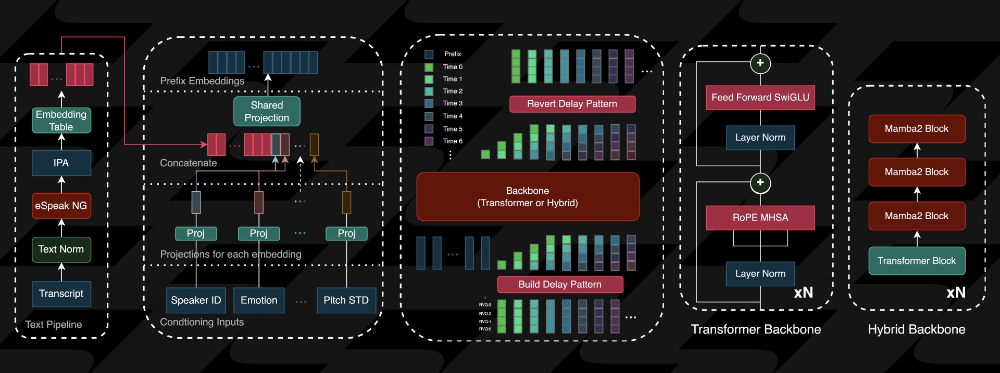

# Zonos PyTorch

  

PyTorch implementation of Zonos.

Zonos is a leading open-weight text-to-speech model trained on more than 200k hours of varied multilingual speech, delivering expressiveness and quality on par with—or even surpassing—top TTS providers.

Zonos follows a straightforward architecture: text normalization and phonemization via eSpeak, followed by DAC token prediction through a transformer or hybrid backbone.
